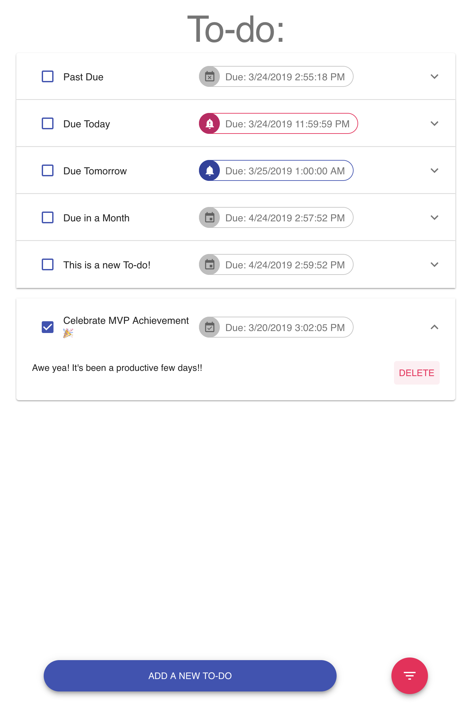
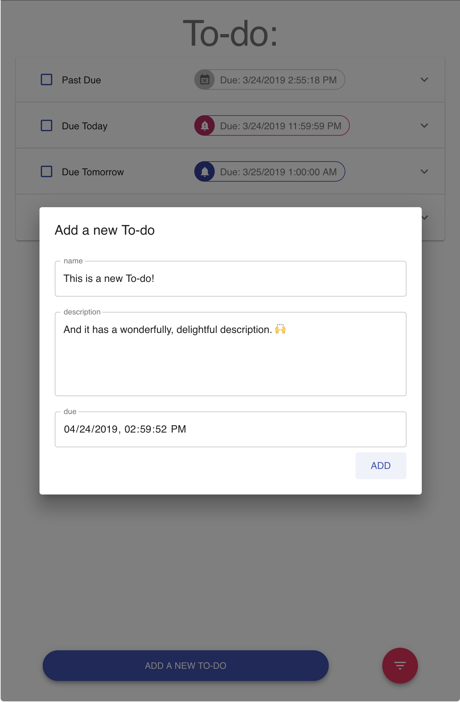
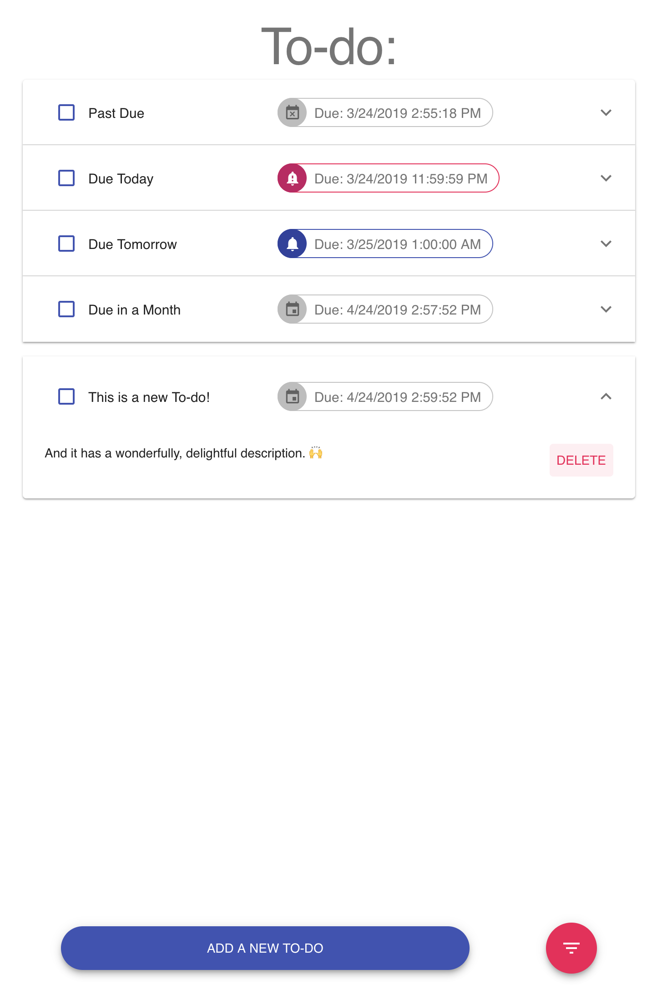
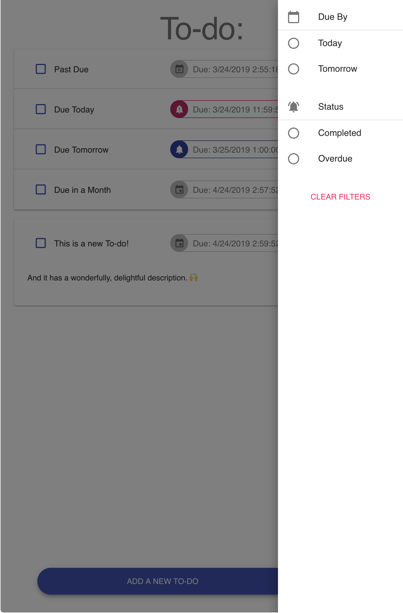
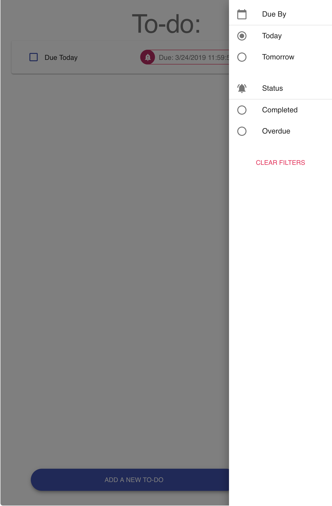
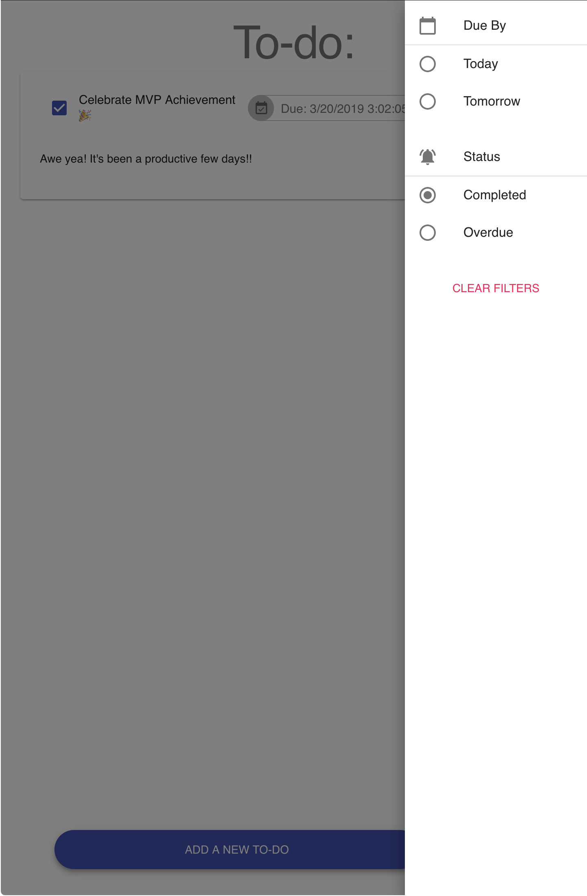
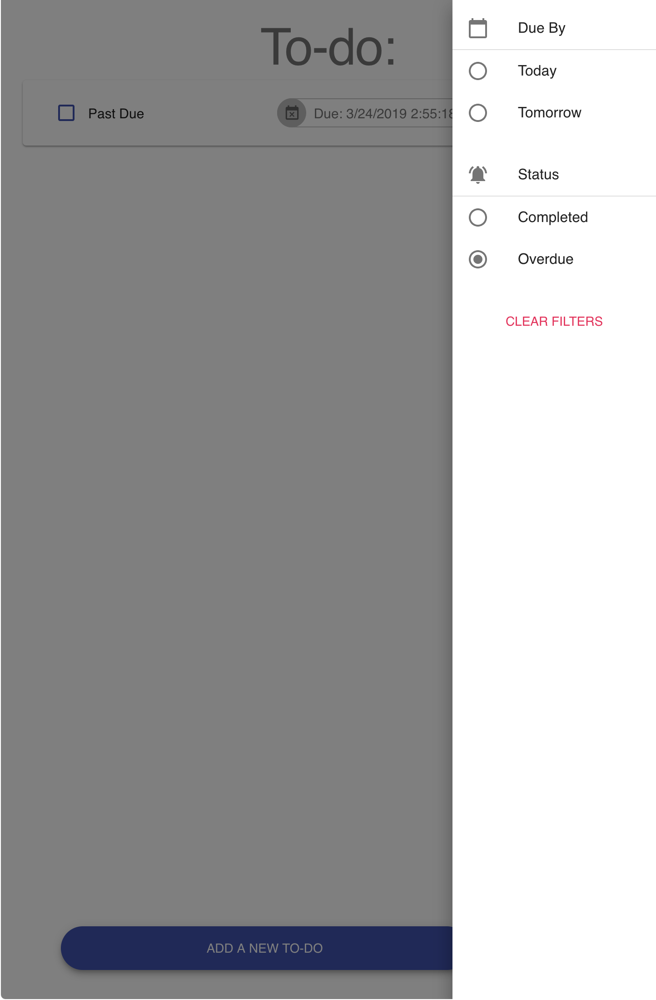

# To-do Microservice Web App

## 

## Getting Started

Run Local Development from Root:

```sh
npm run development:watch:up
```

Stop Local Development from Root:

```sh
npm run development:watch:down
```

Build Containers for Deployment from Root:

```sh
npm run production:build
```

## Environment Variables
Ports to map internally from within Docker and expose;

```sh
./.env
```

DATABASE_SERVICE_PORT

DATABASE_SERVICE_NODEMON_PORT

Firestore Cloud Database Configuration Paramaters;

```sh
./packages/database_service/firebase.development.env
./packages/database_service/firebase.production.env
```

FIREBASE_TYPE

FIREBASE_PROJECT_ID

FIREBASE_PRIVATE_KEY_ID

FIREBASE_PRIVATE_KEY

FIREBASE_CLIENT_EMAIL

FIREBASE_CLIENT_ID

FIREBASE_AUTH_URI

FIREBASE_TOKEN_URI

FIREBASE_AUTH_PROVIDER_X509_CERT_URL

FIREBASE_CLIENT_X509_CERT_URL

## Database Service

A LoopBack REST API Service provides connection to the Firestore Database. 

Browse at: [localhost:4001/explorer](localhost:4001/explorer)
Listens at: [localhost:4001](localhost:4001)

## Discovery Service

TBD

## To-do App 

A React.js Web Application Service

- Axios

  - Connect to database-service (ideally through a discovery-api-service)
- [Hooks](https://reactjs.org/docs/hooks-reference.html)
  - State Management with [useState](https://reactjs.org/docs/hooks-reference.html#usestate), [useEffect](https://reactjs.org/docs/hooks-reference.html#useeffect), [useContext](https://reactjs.org/docs/hooks-reference.html#usecontext), [useMemo](https://reactjs.org/docs/hooks-reference.html#usememo), [useReducer](https://reactjs.org/docs/hooks-reference.html#usereducer)
    - useContext (Provider and Subscriber)
      - Add global data store for managing state between the To-do list and the Filters
    - useReducer
      - Used in conjunction with useContext to provide global state management.
    - useMemo

      - Make use of the context data state and apply memoization for optimization 
        - Apply filters based on due date or status;
          - Due: Today, Tomorrow, 
          - Status: Completed, Overdue
    - useEffect
      - Handles component lifecycles in a functional manner.
    - useState
      - local state management within individual components 
- [Material-UI](https://material-ui.com/)
  - Mobile First layout
  - Behavioral Science approach to design

## Stack

- [Node.js](https://nodejs.org/)
  - [React.js](https://reactjs.org/) Front End Web Application Service
  - [LoopBack.js](https://loopback.io/) REST API Database Service
    - [LoopBack Connector for](https://www.npmjs.com/package/loopback-connector-firestore) Firestore 
  - [Firestore](https://firebase.google.com/docs/firestore/) Cloud Database
- [Docker Compose](https://docs.docker.com/compose/) Containers

## To-do Object

| Property     | Description                                                  |
| ------------ | :----------------------------------------------------------- |
| name         | string required; name/ title of to-do                        |
| description  | string required; description/ details of to-do               |
| due_date     | date time timestamp; corresponding to moment to-do is due for completion |
| deleted_at   | date time timestamp; corresponding to moment of removal      |
| is_completed | boolean; true if completed or false if not completed         |
| created_at   | out of scope for current user stories                        |
| updated_at   | out of scope for current user stories                        |

## Screens












